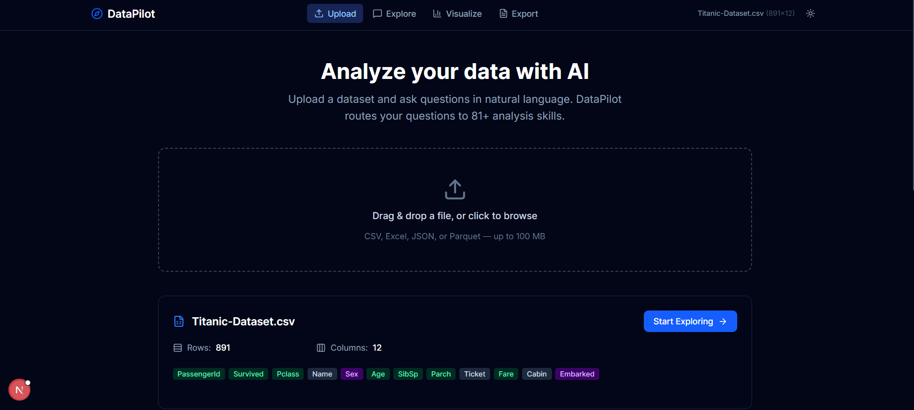
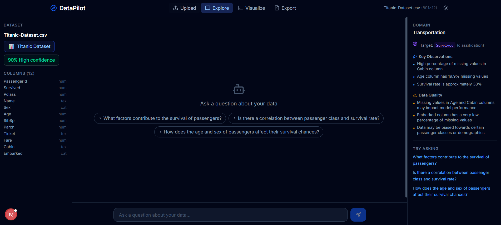
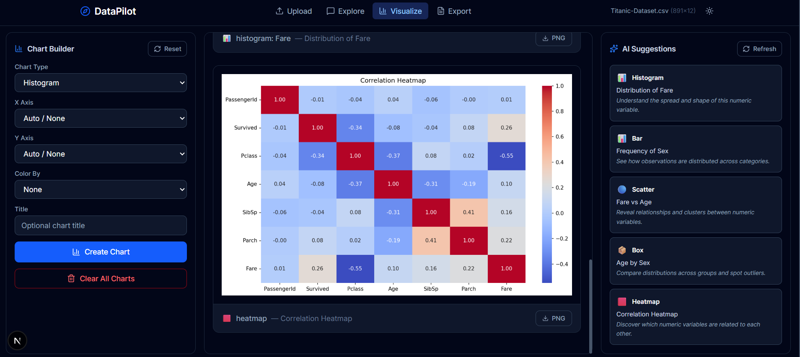

# DataPilot

**AI-powered data analysis.** Upload a dataset, ask questions in natural language, get insights.

DataPilot routes your questions to **81+ analysis skills** spanning statistics, machine learning, NLP, visualization, and more — powered by Groq LLMs.

## Screenshots

| Upload | Explore & Chat | Visualize |
|--------|---------------|-----------|
|  |  |  |

## Features

- **Natural Language Q&A** — Ask "What predicts churn?" and DataPilot picks the right analysis
- **81 Analysis Skills** — Profiling, correlations, hypothesis tests, classification, regression, clustering, time series, NLP, and more
- **Smart 4-Tier Routing** — Keywords → LLM → Semantic Intent → Fallback (works even without API keys)
- **Multi-LLM Support** — Groq + Gemini (task-aware failover), Ollama, Claude, or OpenAI
- **Interactive Chat** — Streaming responses with key points and follow-up suggestions
- **Chart Builder** — AI-suggested visualizations with manual controls
- **Report Export** — PDF, Word, and PowerPoint reports from your analysis history
- **Auto-Pilot** — LLM generates and executes a full analysis plan automatically
- **Dark/Light Mode** — Clean, modern interface built with Next.js and Tailwind

## Quick Start

### Option 1: Docker (recommended)

```bash
git clone https://github.com/Ranjith36963/datapilot.git
cd datapilot

# Set your Groq API key (free at https://console.groq.com)
echo "GROQ_API_KEY=your_key_here" > .env

# Start all services
docker compose up --build
```

Open [http://localhost:3000](http://localhost:3000) and upload a CSV.

### Option 2: Manual Setup

**Backend:**
```bash
python -m venv .venv
source .venv/bin/activate   # Windows: .venv\Scripts\activate
pip install -e ".[all]"
cd backend && uvicorn app.main:app --reload --port 8000
```

**Frontend:**
```bash
cd frontend
npm install
npm run dev
```

**Groq API key:**
```bash
export GROQ_API_KEY=your_key_here
```

Get a free API key at [console.groq.com](https://console.groq.com).

## Architecture

```
┌──────────────┐     ┌──────────────────┐     ┌─────────────────┐
│   Frontend   │────▶│   FastAPI API     │────▶│  DataPilot      │
│   Next.js    │◀────│   16 endpoints    │◀────│  Engine         │
│   :3000      │     │   + WebSocket     │     │  81+ skills     │
└──────────────┘     │   :8000           │     └────────┬────────┘
                     └────────┬─────────┘              │
                              │                   ┌────▼────────────┐
                     ┌────────▼─────────┐    │  4-Tier Router   │
                     │  Session Manager │    │  Keywords → LLM  │
                     │  SQLite + Cache  │    │  → Semantic →    │
                     └──────────────────┘    │    Fallback      │
                                              └────┬────────────┘
                                                   │
                                              ┌────▼────────────┐
                                              │  LLM Failover   │
                                              │  Groq + Gemini  │
                                              └─────────────────┘
```

**Engine modules:**

| Module | Skills | Examples |
|--------|--------|----------|
| `data/` | Profiling, validation, cleaning | `profile_data`, `validate_data`, `curate_dataframe` |
| `analysis/` | Stats, ML, time series | `describe_data`, `classify`, `forecast` |
| `nlp/` | Sentiment, topics, entities | `analyze_sentiment`, `extract_topics` |
| `viz/` | Charts and dashboards | `create_chart`, `auto_chart` |
| `export/` | Reports | PDF, DOCX, PPTX generation |

## Python API

```python
from datapilot import Analyst

analyst = Analyst("sales.csv", llm="groq")
result = analyst.ask("Which features predict revenue?")
print(result.text)           # narrative summary
print(result.key_points)     # bullet points
print(result.suggestions)    # follow-up questions

# Direct skill access
analyst.profile()
analyst.correlations(target="revenue")
analyst.classify(target="churn")
analyst.chart(chart_type="scatter", x="price", y="sales")
analyst.export("report.pdf")
```

## REST API

All endpoints require an `x-session-id` header (returned by upload).

| Method | Endpoint | Description |
|--------|----------|-------------|
| `POST` | `/api/upload` | Upload a dataset (CSV, Excel, JSON, Parquet) |
| `GET` | `/api/preview` | Preview rows |
| `GET` | `/api/profile` | Full dataset profile |
| `POST` | `/api/ask` | Ask a natural-language question |
| `POST` | `/api/analyze` | Run a specific skill directly |
| `POST` | `/api/chart/create` | Create a chart |
| `GET` | `/api/chart/suggest` | AI chart suggestion |
| `POST` | `/api/export/{fmt}` | Generate PDF/DOCX/PPTX report |
| `WS` | `/api/ws/chat` | Streaming chat |

API docs at [http://localhost:8000/docs](http://localhost:8000/docs)

## Configuration

| Environment Variable | Default | Description |
|---------------------|---------|-------------|
| `GROQ_API_KEY` | — | Groq API key (free at [console.groq.com](https://console.groq.com)) |
| `GEMINI_API_KEY` | — | Gemini API key (free at [aistudio.google.com](https://aistudio.google.com)) |
| `GROQ_MODEL` | `llama-3.3-70b-versatile` | Groq model name |
| `DATAPILOT_LLM_PROVIDER` | `groq` | LLM provider: `groq`, `ollama`, `claude`, `openai` |
| `OLLAMA_HOST` | `http://localhost:11434` | Ollama server URL (if using Ollama) |
| `OLLAMA_MODEL` | `llama3.2` | Ollama model name (if using Ollama) |
| `ANTHROPIC_API_KEY` | — | Anthropic API key (for Claude) |
| `OPENAI_API_KEY` | — | OpenAI API key |
| `NEXT_PUBLIC_API_URL` | `http://localhost:8000` | Backend URL for frontend |

> **Note:** DataPilot works without any API keys! The semantic router handles question routing intelligently. LLM keys enhance narratives and enable smart_query, but are optional.

## Development

```bash
make dev-backend    # Start FastAPI with hot reload
make dev-frontend   # Start Next.js dev server
make test           # Run tests
make lint           # Run linters
make lint-fix       # Auto-fix lint issues
```

See [CONTRIBUTING.md](CONTRIBUTING.md) for the full development guide.

## Tech Stack

**Engine:** Python 3.10+ · pandas · scikit-learn · XGBoost · LightGBM · statsmodels · SHAP · TextBlob · matplotlib · seaborn · Plotly

**Backend:** FastAPI · Pydantic v2 · uvicorn · WebSockets

**Frontend:** Next.js 16 · TypeScript · Tailwind CSS 4 · lucide-react · next-themes · react-dropzone

**LLM:** Groq + Gemini (task-aware failover) · Ollama (local) · Anthropic Claude · OpenAI GPT

## License

[MIT](LICENSE)
